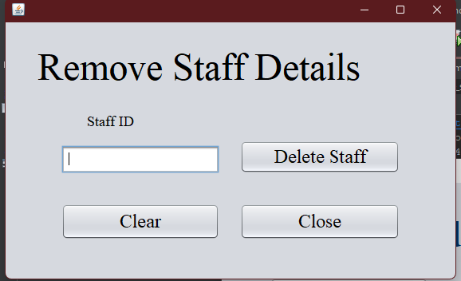

# Library Management System

## Overview
The **Library Management System** is a Java-based desktop application built using **JavaFX** for the user interface, **MySQL** for database storage, and **Maven** for project dependency management. It allows **Admins, Users, and Staff** to log in and manage library-related data efficiently.

## Features
### 🔹 Admin Module
- Add, update, and delete books.
- Manage staff and users.
- View issued and returned books.

### 🔹 User Module
- Search for available books.
- Issue and return books.
- View borrowing history.

### 🔹 Staff Module
- Assist users with book issuance and returns.
- Manage book records.
- Update book availability status.

## Technologies Used
- **Java 17** (JDK 17+ required)
- **JavaFX 13** (UI Development)
- **MySQL 8.0+** (Database)
- **Maven** (Dependency Management)
- **JDBC** (Database Connectivity)

## Setup Instructions

### 1️⃣ Prerequisites
Ensure you have the following installed:
- **Java JDK 17 or higher**: [Download](https://www.oracle.com/java/technologies/javase-downloads.html)
- **MySQL Server 8.0+**: [Download](https://dev.mysql.com/downloads/mysql/)
- **Maven**: [Download](https://maven.apache.org/download.cgi)

### 2️⃣ Clone the Repository
```sh
git clone https://github.com/risav68111/library_Management_System.git
cd library_Management_System
```

### 3️⃣ Database Configuration
1. Create a MySQL database:
```sql
CREATE DATABASE lib_man_sys;
```
2. Import the provided SQL script (`lib_man_sys.sql`) to create tables.
3. Update **`src/main/resources/config.properties`** with your MySQL credentials:
```
db.url=jdbc:mysql://localhost:3306/lib_man_sys
db.username=root
db.password=yourpassword
```

### 4️⃣ Build and Run the Project
#### Using Maven
```sh
mvn clean install
mvn javafx:run
```
#### Running JAR
```sh
java -jar target/library_Management_System-1.0-SNAPSHOT.jar
```

## Screenshots





## Contributing
1. Fork the repository.
2. Create a feature branch (`git checkout -b feature-name`).
3. Commit your changes (`git commit -m 'Added feature X'`).
4. Push to the branch (`git push origin feature-name`).
5. Open a pull request.

## License
This project is **open-source** and available under the [License](LICENSE).

## Contact
📧 **Your Email**: rishav.kumar.68111@gmail.com
📌 **GitHub**: [your-username](https://github.com/risav68111/)

